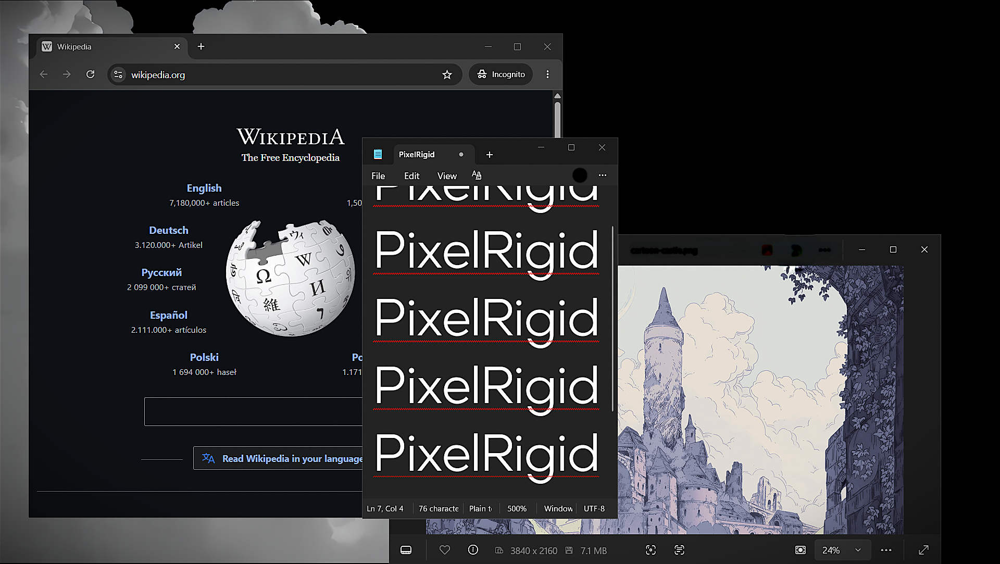

<p align="center">
  
</p>

<p align="center">
  The lightweight utility for removing rounded corners from Windows 11.
</p>

<p align="center">
  
  
  
  
  
</p>

---

## Preview

<p align="center">
  
</p>

---

## Overview

Windows 11 rounds window corners by default.

PixelRigid removes them system-wide using native Windows DWM APIs and Win32 event hooks.

- No polling loop
- No background CPU usage
- Runs silently in the tray

---

## Legal Notice

**PixelRigid** uses only official Windows DWM APIs to modify window appearance system-wide. 

- The app does **not** modify your personal files or documents
- It does **not** modify system registry settings
- It creates a scheduled task only when you enable "Run at startup"
- It creates a config folder at `%LOCALAPPDATA%\PixelRigid` for settings storage
- It does not collect, transmit, or store any personal information
- Standard user mode by default (No UAC). Admin privileges are strictly optional and only needed to style system-level windows.

**Liability:** This software is provided as-is. While extensively tested on Windows 11, we are not liable for unforeseen system incompatibilities or edge cases that may arise on your specific hardware/software configuration. If you experience issues, simply uninstall.

---

## Features

- Sharp corners system-wide
- Event-driven architecture
- 0% CPU usage while idle
- Works on elevated/system windows
- Administrator access toggle
- Real-time status feedback
- Tray controls
- Startup toggle
- Single lightweight executable

---

## How It Works

PixelRigid listens for newly created or focused windows using `WinEventHook`.

When detected, it applies:

```cpp
DwmSetWindowAttribute(
    hwnd,
    DWMWA_WINDOW_CORNER_PREFERENCE,
    DWMWCP_DONOTROUND
);
```

This is handled entirely through native Windows APIs.

---

## Build

```bash
git clone https://github.com/uswuth/PixelRigid.git
cd PixelRigid
dotnet publish -c Release
```

Output:

```shell
bin\Release\net48\PixelRigid.exe
```

---

## Usage

- Launch `PixelRigid.exe`
- Accept the UAC prompt (needed for full system coverage)
- App minimizes to the tray automatically

### Tray Controls

| Action                  | Result                                           |
| ----------------------- | ------------------------------------------------ |
| Left Click              | Toggle Active / Pause                              |
| Right Click             | Open context menu                                  |
| ● Active                | Sharp corners are being applied (click to pause)   |
| ○ Paused                | Sharp corners are paused (click to resume)         |
| Startup Toggle          | Enable/disable run at Windows startup              |
| Request Administrator Access | Elevate privileges to modify system windows      |
| Remove Administrator Access | Revoke elevated privileges                      |
| Uninstall               | Remove app, scheduled task, and config files        |
| Exit                    | Close the application immediately                  |

### Activation Status

The tray tooltip displays the current status:
- **PixelRigid — Active (Admin/User)** - Currently applying sharp corners with admin privileges
- **PixelRigid — Paused (Admin/User)** - Currently paused

A balloon notification appears when administrator access is removed.

---

## Third-Party Notice

PixelRigid utilizes standard API architectures provided by [Microsoft Windows](https://www.microsoft.com/windows). 

[Microsoft](https://www.microsoft.com) and [Windows](https://www.microsoft.com/windows) are trademarks of Microsoft Corporation.

---

## License

MIT License - See [LICENSE](./LICENSE) for details.
